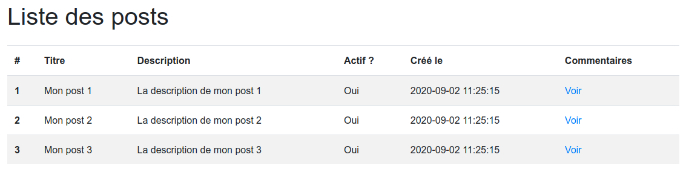
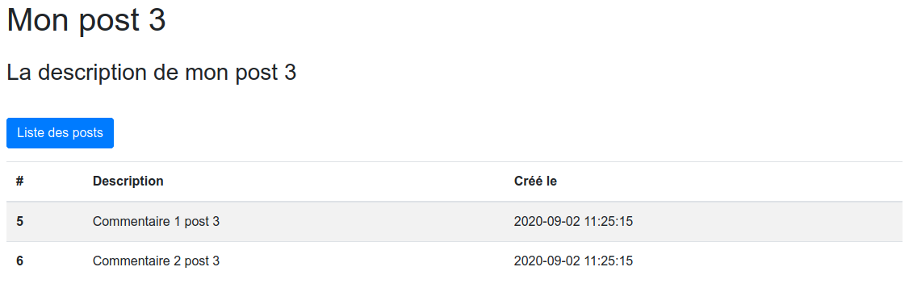

# Introduction MVC


## Sommaire
-  [L'architecture MVC](#Larchitecture-MVC)
-  [Exercice pratique](#Exercice-pratique)

---

## L'architecture MVC

### Pourquoi ?

L'architecture MVC permet une séparation des rôles. Le code est donc :
-  plus facilement maintenable
-  plus clair
-  plus facile lorsqu'il s'agit de travailler à plusieurs dessus
-  évolutif

### Principe

**MVC** : **M**odèle - **V**ue - **C**ontrôleur

Le pattern MVC permet de bien organiser son code source. Il va vous aider à savoir quels fichiers créer, mais surtout à définir leur rôle. Son but est justement de séparer la logique du code en trois parties que l'on retrouve dans des fichiers distincts.

-  **Modèle** : cette partie gère les données de votre site. Son rôle est d'aller récupérer les informations « brutes » dans la base de données, de les organiser et de les assembler pour qu'elles puissent ensuite être traitées par le contrôleur. On y trouve donc entre autres les requêtes SQL.

-  **Vue** : cette partie se concentre sur l'affichage. Elle ne fait presque aucun calcul et se contente de récupérer des variables pour savoir ce qu'elle doit afficher. On y trouve essentiellement du code HTML, CSS et JavaScript, mais aussi quelques boucles et conditions PHP très simples.

-  **Contrôleur** : cette partie gère la logique du code qui prend des décisions. C'est en quelque sorte l'intermédiaire entre le modèle et la vue : le contrôleur va demander au modèle les données, les analyser, prendre des décisions et renvoyer le texte à afficher à la vue. Le contrôleur contient exclusivement du PHP.

*[Source](https://openclassrooms.com/fr/courses/4670706-adoptez-une-architecture-mvc-en-php)*


*[Source](https://fr.wikipedia.org/wiki/Mod%C3%A8le-vue-contr%C3%B4leur)*

---

## Exercice pratique

Le but de cette exercice est de mettre en oeuvre le patterne MVC en PHP "pur", sans l'aide d'un framework.   
Pour cela nous utiliserons PHP 7.4 et une base de données MySQL à l'aide de Docker.

L'objectif sera d'afficher la liste des posts d'un blog, puis la liste des commentaires en cliquant sur un post.

Voici un exemple de solution :





Pour débuter, il faut télécharger le contenu de dossier [exercise](exercise).
Il contient les éléments suivants :
-  `docker-compose.yml` : Fichier pour instancier docker-compose
-  `Dockerfile` : Image Docker pour PHP 7.4
-  `.env` : Variables d'environnement pour Docker
-  `initDatabase.sql` : Fichier d'initialisation de la base de données (schéma + quelques données de test)
-  `models/database.php` : Méthode d'initialisation de la connexion à MySQL

La structure de votre projet est donc la suivante :
```
models/
    \__ database.php
    \__ ...
views/
    \__ ...
controllers/
    \__ ...
index.php // <- Fichier faisant office de routeur
```

La base de données contient 2 tables :
-  `posts`
-  `comments`

Pour les URLs, nous n'utiliserons que des requêtes GET formatées ainsi :
-  `index.php?action=<mon_action>`
-  ou encore `index.php?action=<mon_action>&post_id=<ID d'un post>`

Pour rappel, pour récupérer les paramètres d'une URL, il faut utiliser `$_GET`.  
Sur notre exemple, cela donne :
```php
$action = $_GET['action'];

ou

$postId = $_GET['post_id'];
```

Voici les commandes à lancer pour démarrer votre serveur web :
1.  `$ docker-compose build`
2.  `$ docker-compose up -d`

Vous pourrez ensuite accéder au projet à l'adresse `http://localhost:7777` depuis notre navigateur.

Pour accéder à phpMyAdmin, rendez-vous à l'adresse `http://localhost:7778`.

---

*À vous de jouer !*
