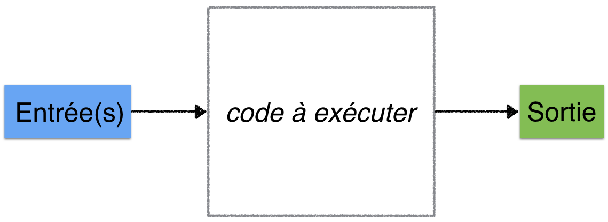

# TP 5 - Introduction aux tests unitaires avec PHPUnit

## Sommaire
-  [Les tests unitaires](#Les-tests-unitaires)
-  [Exercice pratique](#Exercice-pratique)

---

## Les tests unitaires

### Qu'est-ce qu'un test unitaire ?
Le principe d'un test unitaire est très simple : il s'agit d'exécuter du code provenant de l'application à tester et de vérifier que tout s'est bien déroulé comme prévu.

Cela signifie en général que vous allez **vérifier que la valeur retournée est bien la valeur attendue** et/ou que **certaines méthodes ont bien été appelées**.



Un test unitaire est dit "*test boîte blanche*". À la différence d'un "*test boîte noire*", il faut connaître le code (l'avoir lu au moins une fois) pour être en mesure de le tester. Et c'est logique car, lors de l'écriture d'un test unitaire, vous allez devoir appeler le code explicitement.

### Pourquoi réaliser des tests unitaires ?

Si vous ne savez toujours pas pourquoi vous devriez intégrer les tests unitaires dans votre vie quotidienne en tant que développeur, voici quelques raisons de le faire :

-  le test unitaire révèle si la **logique derrière le code (logique métier)** est appropriée et fonctionnera dans tous les cas ;
-  il améliore la **lisibilité du code** et aide les développeurs à comprendre le code de base, ce qui facilite la mise en œuvre des modifications plus rapidement ;
-  des tests unitaires bien conduits sont également de bons outils pour la **documentation** du projet ;
-  les tests sont effectués en un peu plus de **quelques millisecondes**, ce qui vous permet d’en réaliser des centaines en très peu de temps ;
-  les tests unitaires permettent au développeur de remanier le code ultérieurement et de s’assurer que le module continue à fonctionner correctement. Des cas de test sont écrits à cet effet pour toutes les fonctions et méthodes afin que les erreurs puissent être rapidement identifiées et réparées chaque fois que l’une d’elles est créée par l’introduction d’un changement dans le code ;
-  la **qualité finale du code** s’améliorera parce qu’il s’agira en fin de compte d’un code propre et de haute qualité grâce à ces essais continus ;
-  puisque les tests unitaires divisent le code en petits fragments, il est possible de tester différentes parties du projet sans avoir à attendre que d’autres parties soient terminées.

### Les 3 A des tests unitaires

Les trois A du test unitaire constituent **un concept fondamental pour ce type de test**, décrivant un processus en trois étapes.

-  **Organiser**  
C’est la première étape des tests unitaires. Cette étape définit les exigences auxquelles le code doit satisfaire.
-  **Agir**   
C’est l’étape intermédiaire des tests : le moment où le test est effectué, donnant les résultats que vous aurez à analyser par la suite.
-  **Affirmer**   
Dans cette dernière étape, les résultats devront être vérifiés pour voir s’ils sont conformes aux attentes. Si c’est le cas, il est validé et vous pouvez continuer. Dans le cas contraire, les erreurs éventuelles devront être corrigées jusqu’à ce qu’elles cessent d’apparaître.

*[Source OpenClassroom](https://openclassrooms.com/fr/courses/4087056-testez-et-suivez-letat-de-votre-application-php/4419446-premiers-pas-avec-phpunit-et-les-tests-unitaires)*   
*[Source Yeeply](https://fr.yeeply.com/blog/test-unitaire-comment-sy-prendre/)*

---

## Exercice pratique

Le but de cette exercice est de mettre en oeuvre les tests unitaires à l'aide de la bibliothèque [PHPUnit](https://phpunit.readthedocs.io/en/7.5/).
Pour cela nous allons installer le composant suivant :
```bash
$ composer require --dev symfony/phpunit-bridge
```

On pourrez ensuite lancer les tests unitaires via la commande :
```bash
$ ./bin/phpunit
```

Pour plus d'information, vous pourrez vous référer à la [documentation de Symfony](https://symfony.com/doc/current/testing.html#the-phpunit-testing-framework).

Tous les tests unitaires se situent dans le répertoire `tests` situé à la racine du projet.

L'objectif sera de réaliser des tests unitaires sur la classe `Utils\Toolbox.php`
Commencez par créer le fichier `Toolbox.php` dans `src/Utils` :
```php
<?php

namespace App\Utils;

class Toolbox
{
    /**
     * Compte le nombre de mots dans une chaîne de caractères
     *
     * @param string $text Texte à analyser
     * @return integer Nombre de mots
     */
    public function getWordsNumber(string $text): int
    {
        return 0;
    }
}
```

Puis créer le fichier `ToolboxTest.php` dans `tests/Utils` :
```php
<?php

namespace App\Tests\Utils;

use App\Utils\Toolbox;
use PHPUnit\Framework\TestCase;

class ToolboxTest extends TestCase
{
    public function testGetWordsNumberBasic()
    {
        $toolbox = new Toolbox();
        $text = 'Sit aliquam eum aliquam saepe sunt exercitationem.';

        $this->assertEquals(7, $toolbox->getWordsNumber($text));
    }
}
```

Si vous lancez vos tests unitaires, ces derniers échouent. En effet, `getWordsNumber` retourne actuellement tout le temps la valeur `0`.

Modifiez le code de la classe `Toolbox.php` pour faire passer les tests.
Essayer désormais en ajoutant ce test :
```php
public function testGetWordsNumberComplex()
{
    $toolbox = new Toolbox();
    $text = 'Salut l\'ami, vous
    avez          une b3lle mine !';

    $this->assertEquals(8, $toolbox->getWordsNumber($text));
}
```
Dès que les tests passent, entrez de nouveaux jeux de données et relancer l'exécution des tests.  
La fonction PHP `str_word_count()` permet déjà de compter les mots d'une chaîne de cractères. Essayez de faire aussi bien 😉 !

Cette façon de développer est appelée **TDD** pour [Test-Driven Development](https://fr.wikipedia.org/wiki/Test_driven_development). C'est une excellente approche pour obtenir un code robuste et bien couvert par les tests unitaires.

Ecrivez ensuite une fonction `countLinks()` qui compte le nombre de liens HTML dans une chaîne de caractères en suivant la méthodologie TDD.   

---

*À vous de jouer !*
